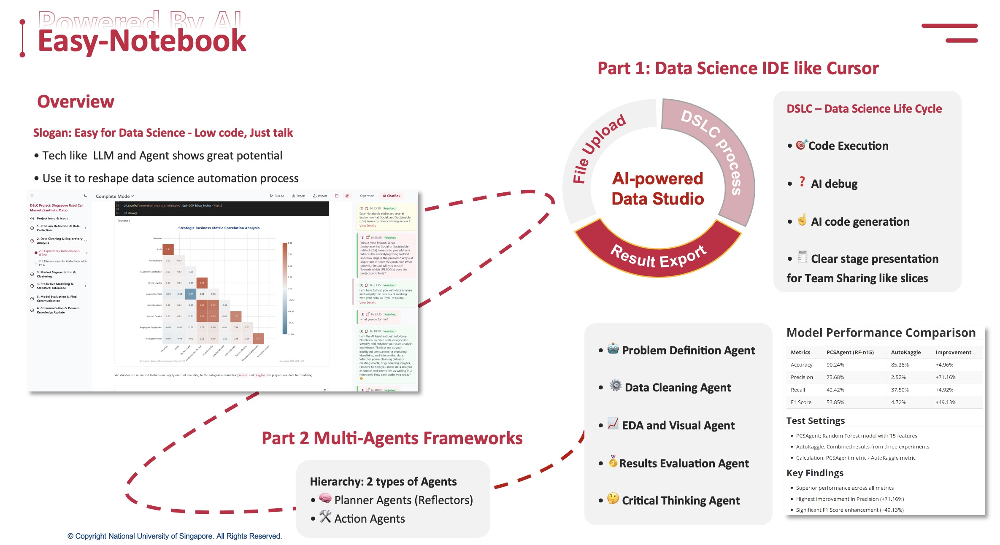
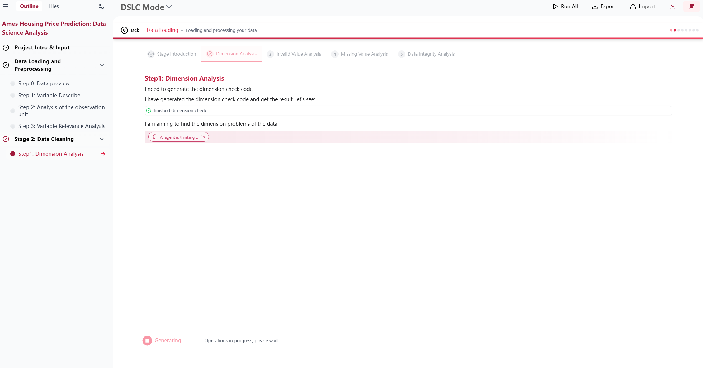
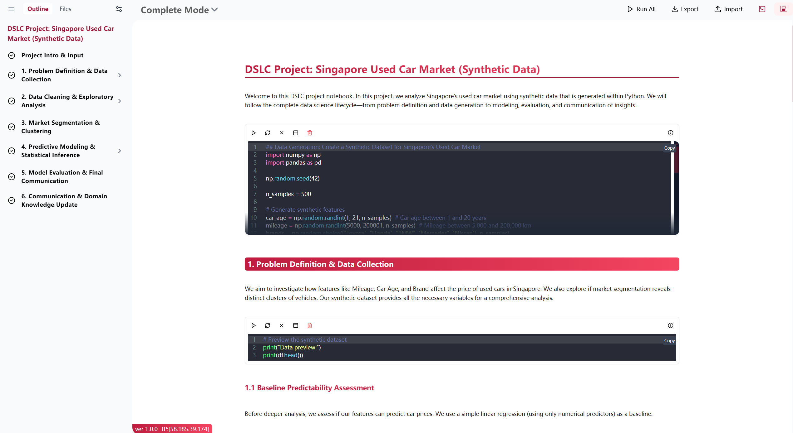
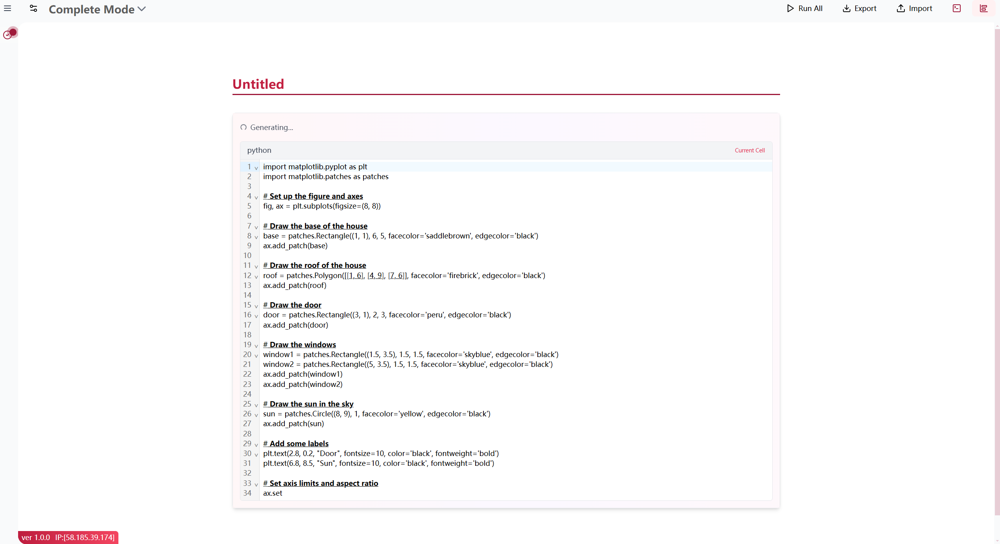
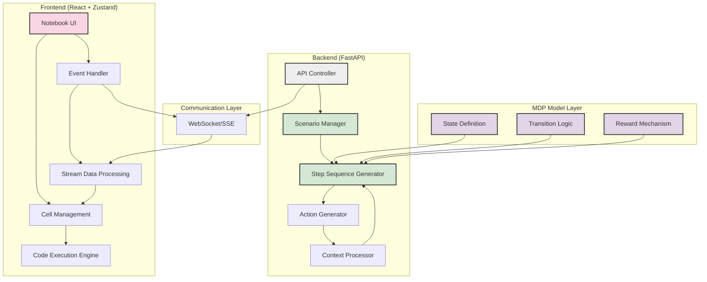

#  Easy-Notebook

> **AI-Powered Data Science Platform | Transparent Interactive Analysis | Stateless Architecture Design**



## 📌 Overview

EasyRemote-Notebook is a revolutionary data science platform that addresses the core challenge in AI-assisted tools: **balancing automation with user control**. Through its unique stateless backend design and multi-stage scenario workflows, it achieves perfect harmony between AI automation and complete transparency.

**[👉 Live Demo](https://easy-notebook.silan.tech) • [📚 Documentation](https://example.com/docs) • [🚀 Quick Start](#quick-start) • [💼 Use Cases](#use-cases)**

## 🖼️ Product Showcase

<!-- Product screenshots -->


<div align="center">
  
  <p><i>Powerful automated data analysis capabilities while maintaining complete transparency at every step</i></p>
</div>

<div align="center">
  
  <p><i>Fluid interactive notebook interface supporting instant code modifications and execution</i></p>
</div>

<div align="center">
  
  <p><i>Real-time generation of high-quality data analysis code with full visualization of the process</i></p>
</div>

## ✨ Innovative Design Concepts

EasyRemote-Notebook seamlessly integrates **scenario-based workflow design** with an **interactive notebook interface**, achieving several core innovations:

### 1. Stateless Backend Design

The project employs a completely **stateless** backend design, representing a significant innovation:

- **MDP (Markov Decision Process) as Structural Support**: The backend workflow is designed around the MDP model, breaking complex data analysis tasks into discrete state transition processes.
- **Context Passing Instead of State Persistence**: Each request carries complete context, with the backend maintaining no session state, ensuring high availability and horizontal scalability.
- **Action-Context Pattern**: The `StepTemplate` class implements an action template system that abstracts each interaction step as a series of actions, passing context to the frontend.

```python
def _get_context(self) -> Dict[str, Any]:
    """Return context containing current todo items"""
    return {**self.context, "toDoList": self.todo_list}
```

### 2. Multi-Stage Scenario Design

The system employs a carefully designed scenario structure that breaks data science workflows into manageable stages and steps:

- **Stage-Based Organization**: Including stages like `data-loading-and-hypothesis-proposal` and `data-cleaning`.
- **Step Sequencing**: Each stage contains multiple steps that can be streamed and presented independently.
- **Dynamic Sequence Generation**: Execution sequences are dynamically generated based on step indices and context, enabling highly flexible workflows.

```python
async def generate_data_cleaning_sequence(step_index: int, step: Dict[str, Any], context: Optional[Dict[str, Any]] = None, stream: bool = False):
    sequence_generators = {
        0: generate_data_cleaning_sequence_step0,
        1: generate_data_cleaning_sequence_step1,
        # ...more steps
    }
    generator = sequence_generators.get(step_index)
  
	if generator:
        return await generator(step, context, stream)
```

### 3. Streaming Code Generation and Execution

Unlike traditional "black box" AI tools, EasyRemote-Notebook implements a completely transparent AI assistance process:

- **Real-Time Code Streaming**: Backend-generated code is transmitted to the frontend in real-time, allowing users to observe the AI's thinking and code generation process.
- **Visualized Execution**: Generated code can be immediately executed in the frontend environment with instantly visible results.
- **Full User Intervention**: Users can modify AI-generated code at any time, maintaining complete control over the analysis process.

```javascript
case 'addCell2EndWithContent': {
    console.log('Adding new cell:', data);
    await globalUpdateInterface.addNewCell2End(data.data.payload.type, data.data.payload.description);
    await globalUpdateInterface.addNewContent2CurrentCell(data.data.payload.content);
    break;
}
```

### 4. Event-Driven Interaction Model

The system adopts an event-driven model, enabling complex interactions between frontend and backend through a rich set of event types:

```javascript
export const EVENT_TYPES = {
    // User-related events
    USER_ASK_QUESTION: 'user_ask_question',
    USER_NEW_INSTRUCTION: 'user_new_instruction',
    USER_FILE_UPLOAD: 'user_file_upload',

    // AI-related events
    AI_UNDERSTANDING: 'ai_understanding',
    AI_EXPLAINING_PROCESS: 'ai_explaining_process',
    AI_WRITING_CODE: 'ai_writing_code',
    // ...more event types
};
```

## 🏗️ System Architecture

<div align="center">



</div>

### 🤖 Multi-Agent Execution Flow

EasyRemote-Notebook integrates a **team of collaborative agents** into each analysis step. These agents are split into two main roles:

- 🛠️ **Action Agents**: Execute concrete tasks such as code generation, data analysis, and result extraction.
- 🧠 **Planner Agents (Reflectors)**: Evaluate whether the step's goal has been sufficiently achieved. Only when the planner confirms success will the workflow advance to the next step.

Each step runs as a finite state machine (FSM) composed of event handlers like `start`, `think_event`, `exe_code_cli`, etc. The system guarantees that:

> ✅ *No step transitions until the planner deems the task complete.*

This ensures a **goal-driven**, **quality-controlled** execution pipeline that’s both powerful and reliable for complex workflows.


## 🔧 Core Technical Architecture

### Frontend Architecture

- **React-Based Responsive UI**: Combined with Zustand state management for efficient state updates and UI rendering
- **Multi-Mode Views**: Supporting Complete Mode, Step Mode, and DSLC Mode for various interaction preferences
- **Adaptive Cell System**: Supporting code, Markdown, hybrid, and file cell types
- **WebSocket/SSE Streaming Communication**: Enabling real-time streaming updates of code and outputs

### Backend Architecture

- **FastAPI-Based Microservice Design**: High-performance asynchronous API handling
- **Scenario-Stage-Step Three-Layer Structure**: Strictly hierarchical task decomposition mechanism
- **Dynamic Sequence Generators**: Generating execution step sequences based on context
- **Stateless Computation Model**: All states passed through context, with no session state saved by the backend

```mermaid
flowchart LR
    A[User] --> B[Frontend Notebook Interface]
    B --> C{Event Trigger}
    C -->|Question/Instruction| D[Backend Scenario Manager]
    D --> E[Step Sequence Generator]
    E --> F[Context Building]
    F --> G[Action Generation]
    G --> H[Streaming Response]
    H --> I[Frontend Event Handler]
    I --> J[Cell Creation/Update]
    J --> K[Code Execution]
    K --> L[Output Display]
    L --> A

    style A fill:#f9f,stroke:#333,stroke-width:2px
    style B fill:#bbf,stroke:#333,stroke-width:2px
    style D fill:#bfb,stroke:#333,stroke-width:2px
    style E fill:#bfb,stroke:#333,stroke-width:2px
    style G fill:#bfb,stroke:#333,stroke-width:2px
    style H fill:#fbb,stroke:#333,stroke-width:2px
    style J fill:#bbf,stroke:#333,stroke-width:2px
    style L fill:#bbf,stroke:#333,stroke-width:2px
```

<div align="center">



</div>

## 💼 Use Cases

EasyRemote-Notebook is particularly well-suited for:

1. **Data Science Education**: Learners can observe the complete data analysis process and code generation logic
2. **Rapid Data Exploration**: Data scientists can quickly initiate analysis workflows while retaining full intervention capabilities
3. **Collaborative Team Analysis**: Providing standardized analysis workflows that facilitate team understanding and collaboration
4. **AI-Assisted Programming**: Gaining AI code generation and analysis capabilities while maintaining transparency and control

## 🚀 Quick Start

```bash
# Clone repository
git clone https://github.com/Qingbolan/EasyRemote-notebook.git
cd EasyRemote-notebook

# Frontend setup
cd easyremote-notebook
npm install
npm run dev

# Backend setup
cd python/backend
pip install -r requirements.txt
python -m uvicorn main:app --reload
```

## 🔥 Technical Advantages

1. **Stateless Design**: Enabling high scalability and fault tolerance
2. **MDP Structural Support**: Modeling complex data science tasks as state transition processes
3. **Fully Transparent AI Collaboration**: Every step of AI-generated code is visible and editable to users
4. **Multi-Stage Scenario Flow**: Structured data science workflows for managing complex tasks
5. **Streaming Experience**: Fluid experience with real-time code generation and execution
6. **Highly Customizable**: Supporting user takeover of the analysis process at any time

This unique architectural design enables EasyRemote-Notebook to provide powerful AI assistance for data science work while maintaining complete transparency, achieving the perfect balance between "AI assistance" and "user control."

## 📝 License

This project is licensed under the [Modified Proprietary License](LICENSE).

**© 2024–2025 Silan Hu. All rights reserved.**

This software and associated documentation files (the "Software") are the exclusive property of Silan Hu. The Software is provided "as is", without warranty of any kind, express or implied.

You are permitted to view, use, modify, and distribute the Software for **personal, educational, and research purposes**, **provided that proper attribution is maintained**, and all license terms are followed.

**Attribution Notice:**  "Based on Easy-Notebook by Silan Hu (https://github.com/Qingbolan)"

Commercial use requires **explicit written permission** from the owner. For licensing inquiries or commercial requests, please contact: silan.hu@u.nus.edu

## 🤝 Contributing

Contributions are welcome! Please read the [Contribution Guidelines](CONTRIBUTING.md) to get started.
Note that all contributions will be subject to review and approval by the project owner.

## 📬 Contact

- Project Owner: [Silan Hu (Qingbolan)](https://github.com/Qingbolan)
- Feedback: [Issues Page](https://github.com/Qingbolan/Easy-notebook/issues)
- Personal Website: [https://silan.tech](https://silan.tech)
